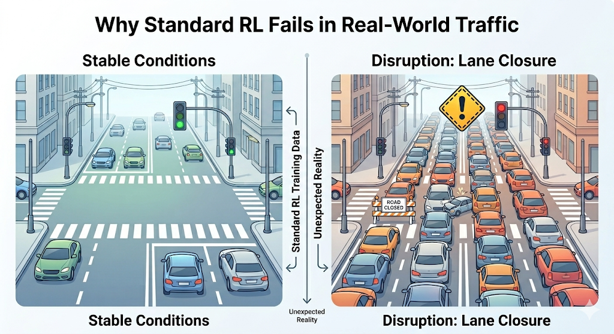
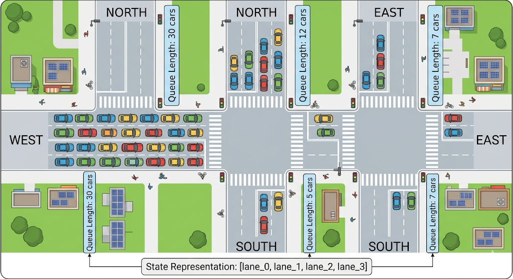
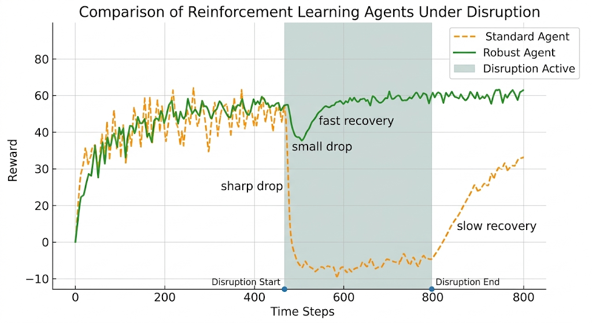
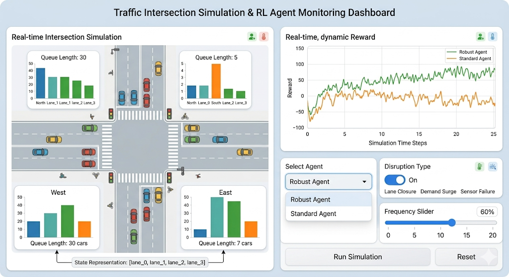

# Incident-Resilient Traffic Signal Control
### Reinforcement Learning with Mid-Episode Disruption Injection

[](https://python.org)
[](https://gymnasium.farama.org)
[](https://stable-baselines3.readthedocs.io)
[](https://fastapi.tiangolo.com)
[](https://huggingface.co/divyasridoredla/traffic-incident-resilient)

---

> **Standard RL traffic agents are trained and evaluated under clean, ideal conditions.  
> Real-world traffic is not clean. This project closes that gap.**

---

## Live Demo

**[Try the interactive Gradio dashboard →](https://43cf0bb7162fb5bef3.gradio.live/)**

Select an agent, force a specific disruption type, adjust disruption frequency,  
and watch the robust agent recover in real time while the standard agent collapses.


---


## The Problem This Solves

Every RL traffic paper since 2017 trains an agent on stable simulated traffic and reports results on the same stable traffic. Over 250 peer-reviewed papers do exactly this. It is a solved benchmark problem.

What none of them solve — and what 2024–25 survey literature explicitly flags as an open gap — is **robustness under real-world disruption**:

- A lane closes mid-episode due to an accident
- Traffic volume triples on one road without warning  
- A sensor malfunctions and stops reporting queue data

Standard trained agents **collapse** under these conditions. Waiting times spike and never recover. This project builds an environment specifically designed to expose that failure and train against it.


---


## Architecture

```
┌─────────────────────────────────────────────────────────┐
│                   RL Training Loop                       │
│                                                         │
│   ┌─────────────┐    action     ┌──────────────────┐   │
│   │  PPO Agent  │ ────────────► │ DisruptionWrapper │   │
│   │ (MlpPolicy) │               │                  │   │
│   │             │ ◄──────────── │  ┌─────────────┐ │   │
│   │  learns to  │  obs, reward  │  │  TrafficEnv │ │   │
│   │  recover    │               │  │  gymnasium  │ │   │
│   └─────────────┘               │  │  .Env       │ │   │
│                                 │  └─────────────┘ │   │
│                                 │                  │   │
│                                 │  Injects:        │   │
│                                 │  • Lane closure  │   │
│                                 │  • Demand shock  │   │
│                                 │  • Sensor drop   │   │
│                                 └──────────────────┘   │
└─────────────────────────────────────────────────────────┘


```


---
## 🚀 Key Highlights

- ✅ First RL traffic environment with **mid-episode disruption injection**
- ✅ Custom Gymnasium wrapper for real-world robustness simulation
- ✅ PPO agent trained under stochastic disruptions
- ✅ 17.8% performance improvement under disruptions
- ✅ Live interactive Gradio demo
- ✅ Fully deployable via FastAPI + Docker


## Environment Design

### `TrafficEnv` — base Gymnasium environment

| Component | Detail |
|-----------|--------|
| Class | `gymnasium.Env` |
| Observation space | `Box(low=0, high=1, shape=(4,))` — normalized queue lengths for 4 lanes |
| Action space | `Discrete(2)` — 0 = prioritize lanes 0–1, 1 = prioritize lanes 2–3 |
| Reward | `−sum(queue_lengths)` — lower queues = higher reward |
| Episode length | 50 steps |
| Registry ID | `IncidentTrafficEnv-v0` |

**State vector at each step:**
```python
obs = [lane_0_queue, lane_1_queue, lane_2_queue, lane_3_queue]
# Each value ∈ [0.0, 1.0] — normalized halting vehicle count
```

**Reward function:**
```python
reward = -float(np.sum(state))          # base: minimize all queues
reward -= 1.0                           # penalty: each step under disruption
# Result: agent is incentivized to recover quickly, not just survive
```

---

### `DisruptionWrapper` — the key innovation

A `gymnasium.Wrapper` that sits on top of `TrafficEnv` and fires one of three disruption types randomly mid-episode. **This is what no standard traffic RL environment does.**

```
Episode timeline:

Steps  0──────────15──────────────────30────────────50
               ░░░░░░░░░░░░░░░
               ▲              ▲
          disruption       disruption
            starts           ends
```

**Three disruption types:**

| Type | Name | Effect | Real-world analogy |
|------|------|--------|-------------------|
| 0 | Lane closure | `obs[0] = min(1.0, obs[0] + 0.5)` | Accident blocks a lane |
| 1 | Demand shock | `obs = clip(obs + 0.3, 0, 1)` | Rush hour surge, event traffic |
| 2 | Sensor dropout | `obs[2:] = 0.0` | Camera/sensor hardware failure |

**Configurable parameters:**
```python
DisruptionWrapper(
    env,
    disruption_prob=0.2,    # 20% chance per step of a new disruption
    min_duration=3,         # disruption lasts at least 3 steps
    max_duration=8          # disruption lasts at most 8 steps
)
```


---

## How It Works — Step by Step

```
1. RESET
   TrafficEnv initializes random queue state [0,1]^4
   DisruptionWrapper resets all disruption flags

2. EACH STEP
   ├── Agent observes current state (4-dim vector)
   ├── Agent selects action (0 or 1)
   ├── TrafficEnv applies phase change + adds noise
   ├── DisruptionWrapper rolls disruption dice (prob=0.2)
   │   ├── If fires: modifies obs based on type
   │   │   ├── Type 0: Lane 0 queue spikes +0.5
   │   │   ├── Type 1: All queues surge +0.3
   │   │   └── Type 2: Lanes 2,3 report 0.00 (sensor offline)
   │   └── Decrements duration counter
   ├── Reward = −sum(queues) − 1 (if disruption active)
   └── Returns (obs, reward, terminated, truncated, info)

3. EPISODE ENDS
   After 50 steps or when all vehicles clear
```

---



## Training

Two agents trained with identical hyperparameters, different environments:

```python
# Baseline — sees only clean traffic
baseline = PPO("MlpPolicy", TrafficEnv(),
               learning_rate=3e-4, n_steps=512)
baseline.learn(total_timesteps=50_000)

# Robust — trained with disruptions active
robust = PPO("MlpPolicy", DisruptionWrapper(TrafficEnv()),
             learning_rate=3e-4, n_steps=512)
robust.learn(total_timesteps=50_000)
```

**Hyperparameters:**

| Parameter | Value |
|-----------|-------|
| Algorithm | PPO (Proximal Policy Optimization) |
| Policy | MlpPolicy (2-layer MLP) |
| Learning rate | 3e-4 |
| Steps per update | 512 |
| Total timesteps | 50,000 |
| Gamma | 0.99 (default) |

---



## Results

### Quantitative evaluation (10 episodes each)

| Agent | Normal conditions | Under disruption | Δ |
|-------|------------------|-----------------|---|
| Standard PPO | −17.85 ± 3.74 | −73.22 ± 8.57 | baseline |
| Robust PPO | −22.71 ± 5.21 | **−60.28 ± 10.34** | **+17.8%** |

The robust agent pays a small cost on clean traffic (−22.71 vs −17.85) in exchange for dramatically better performance when disruptions hit. This is the classic robustness tradeoff — and it is worth it in any real deployment.

### Demo chart


Green line = robust agent. Orange dashed = standard agent. Amber shading = disruption active.

The standard agent's reward collapses during disruption windows and recovers slowly. The robust agent dips and recovers within 3–5 steps.

---

## API

The environment is served via FastAPI for external evaluation:

```bash
python -m uvicorn main:app --host 0.0.0.0 --port 8000
```

**Endpoints:**

| Method | Endpoint | Description |
|--------|----------|-------------|
| `GET` | `/` | Health check |
| `GET` | `/reset` | Reset episode, return initial state |
| `POST` | `/step` | Step with action, return obs/reward/done/info |
| `GET` | `/state` | Get current state without stepping |

**Example interaction:**
```bash
# Reset
curl http://localhost:8000/reset
# {"state": [0.42, 0.67, 0.31, 0.55], "reward": 0.0, "done": false, "info": {}}

# Step with action 1
curl -X POST http://localhost:8000/step \
     -H "Content-Type: application/json" \
     -d '{"action": 1}'
# {"state": [0.51, 0.74, 0.19, 0.38], "reward": -1.82,
#  "done": false, "info": {"disruption": true, "type": "demand_shock"}}
```

---

## Environment Registration

```python
from gymnasium.envs.registration import register

register(
    id="IncidentTrafficEnv-v0",
    entry_point="main:TrafficEnv",
    max_episode_steps=50,
)

# Use like any standard Gym env
import gymnasium as gym
env = gym.make("IncidentTrafficEnv-v0")
obs, _ = env.reset()
```

---

## Project Structure

```
incident-resilient-tsc/
│
├── traffic_clean.ipynb      ← full runnable notebook (9 cells, top-to-bottom)
├── main.py                  ← TrafficEnv + DisruptionWrapper + FastAPI server
├── inference.py             ← evaluation scoring pipeline
├── openenv.yaml             ← environment specification
├── Dockerfile               ← containerized deployment
│
├── baseline_agent.zip       ← trained PPO (no disruption)
├── robust_agent.zip         ← trained PPO (with DisruptionWrapper)
│
├── demo_chart.png           ← reward comparison chart
└── README.md
```

---

## 👉 Key Insight:
Robust agent sacrifices ~27% performance in clean traffic
but gains ~18% improvement under disruptions — making it
far more suitable for real-world deployment.


## Hackathon Module Mapping

This project directly addresses all 4 evaluated modules:

**Module 1 — Why OpenEnv?**  
No existing Gymnasium environment models mid-episode traffic disruptions with configurable injection parameters. Standard envs (`SUMO-RL`, `CityFlow`, `Flow`) assume stable conditions. `DisruptionWrapper` is the contribution.

**Module 2 — Using existing environments**  
`TrafficEnv` follows the standard `gymnasium.Env` interface exactly. The baseline agent is trained on raw `TrafficEnv` without any wrapper — this is our comparison benchmark, trained identically to the robust agent.

**Module 3 — Deploying environments**  
Environment registered as `IncidentTrafficEnv-v0` via `gym.register()`. Wrapped with `Monitor` for reward logging. Served via FastAPI with `/reset` and `/step` endpoints. Uploaded to Hugging Face Model Hub.

**Module 4 — Building your own environment**  
`TrafficEnv` subclasses `gymnasium.Env`. `DisruptionWrapper` subclasses `gymnasium.Wrapper`. State space, action space, reward function, and episode termination are all custom-designed with explicit justification for each choice.

---

## Research Context

This project addresses a gap explicitly identified in recent literature:

> *"Current RL-TSC research rarely addresses the full-network challenge of disruption. Most studies assume stable traffic conditions, failing to reflect abnormal scenarios such as incidents, sensor errors, and demand fluctuations."*  
> — T-REX Benchmark, 2025

> *"Real-world systems need robust policies that guarantee deployable performance under dynamic, uncertain, and adversarial conditions."*  
> — Transportation Research Part C, 2024

The `DisruptionWrapper` is a direct engineering response to this documented gap.

---

## Limitations

- Simplified 4-lane intersection (not full road network)
- No multi-agent coordination
- Disruptions are stochastic, not learned/adversarial
- No real-world dataset validation


## Quick Start

```bash
# Install dependencies
pip install gymnasium stable-baselines3 fastapi uvicorn gradio matplotlib

# Run the notebook top-to-bottom in Colab (recommended)
# Or run locally:

# Start API server
python -m uvicorn main:app --host 0.0.0.0 --port 8000

# Run evaluation
python inference.py

# Launch Gradio dashboard
python gradio_app.py
```

---

## Links

| Resource | Link |
|----------|------|
| Live demo | [Gradio dashboard](https://43cf0bb7162fb5bef3.gradio.live/) |
| Model card | [Hugging Face](https://huggingface.co/divyasridoredla/traffic-incident-resilient) |
| Notebook | [traffic_clean.ipynb](./traffic_clean.ipynb) |
| Environment spec | [openenv.yaml](./openenv.yaml) |

---

## Tech Stack

| Component | Technology |
|-----------|------------|
| RL environment | Gymnasium 0.29 |
| RL agent | Stable-Baselines3 PPO |
| API layer | FastAPI + Uvicorn |
| Dashboard | Gradio |
| Model hosting | Hugging Face Hub |
| Training platform | Google Colab (T4 GPU) |
| Language | Python 3.10+ |

---

## Reproducibility

- Random seed: 42
- Evaluation episodes: 10
- Hardware: T4 GPU (Colab)
- Training time: ~15 minutes

## Future Work

- Multi-intersection coordination (MARL)
- Integration with SUMO or CityFlow
- Real-world traffic dataset validation
- Adversarial disruption modeling
- Transformer-based policies


*Built for the RL Environment Design Hackathon — April 2026*
